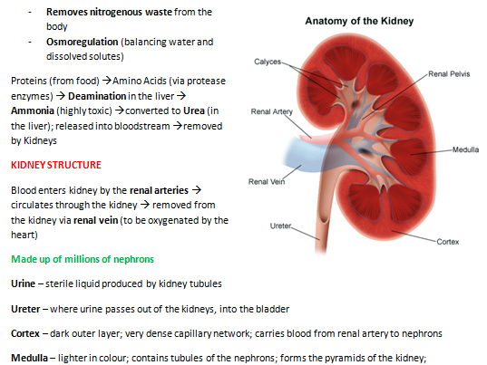
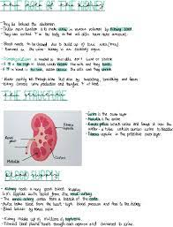
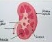
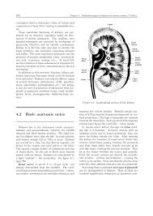
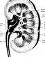
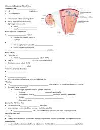
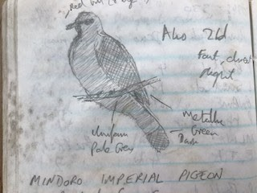
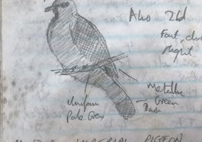
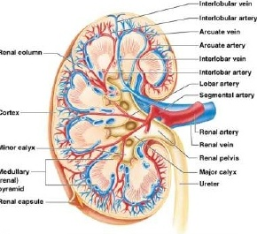
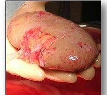

# Object-extractor-from-a-image

## Problem
In today's age, as everything has come online, everything that can be automated should be automated. Educational institutes use online LMS to automate most of their day to day activities. One of them includes assignment submission and checking. It's very seamless to create a MCQ based exam and get it automatically evaluated. But the problem occurs when the requirement is of having questions/assignments based on <b>Diagrams<b>.

## Proposed Solution
The above problem can be solved with the help of Deep Learning & Computer Vision. This repository contains a Custom Object Detector made with the Yolov4 object detection model and Darknet.

## Tech
* Python
* OpenCV
* Yolov4
* Darknet

## External Dependencies
* Google Collab
* [Labelimg](https://github.com/tzutalin/labelImg)

## Training the model
1. [50 images](Training) were manually labelled using LabelImg and used as the training dataset for the model. 
2. One class called as 'object' was used to identify the diagrams in a particular image.
3. The model was trained on Google Collab, here is the [File](https://colab.research.google.com/drive/1OA_iwX2PsMf0gyXtuGiTIGuVb0PzhMNF?usp=sharing).
4. The configuration and setup related to the training of the model are specified within the Collab File linked above.

## Testing the model
1. The trained model was tested on these [7 images](Testing) which were not part of the training dataset.

## Results

### 1. Input
  
### 1. Output
 

### 2. Input
  
### 2. Output
 

### 3. Input
  
### 3. Output
 

### 4. Input
  
### 4. Output
No detection.

### 5. Input
  
### 5. Output
 

### 6. Input
  
### 6. Output
 

### 7. Input
  
### 7. Output
 
 

## Possible issues that need to be tackled
1. Skewed images.  
This can be solved with the help of the Open CV library.
2. Low resolution images.
3. Shadows on partial/full part of the image.  
The above two issues could be solved with having a better training dataset with more images. This may still not solve some very edge cases. For only these cases application can be used for manual intervention.
4. Cut-out text as the labels on the image.  
A different class can be created for specifically detecting this case, in order to not consider that while evaluating.

## Happy Detecting
